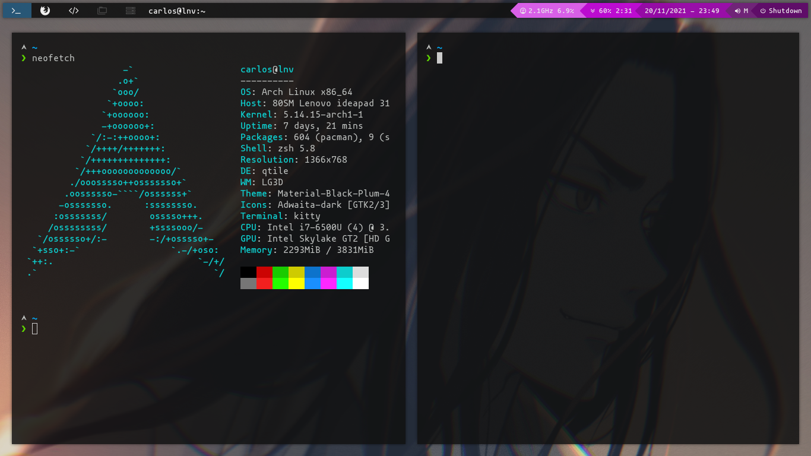

# CTMarin Dotfiles
## Introduction
Welcome to my dotfiles repository. Here you can find the main configuration files of my linux system.

## Installation
Git clone this repository and put its content on your ```$HOME``` directory. If you have a previous configuration, choose only the files you want to add or replace, or overwrite yours with the cloned ones.
> __WARNING:__ Note that for making it work as expected you will need to install all the needed dependencies.

## Current Software Summary
| Name | Description |
| ---- | ----------- |
| [Qtile](http://www.qtile.org/) | Window Manager | 
| [Rofi](https://github.com/davatorium/rofi) | Application Launcher | 
| [Kitty](https://sw.kovidgoyal.net/kitty/) | GPU based Terminal Emulator |
| [Ranger](https://github.com/ranger/ranger) | CLI Filemanager | 
| [Thunar](https://wiki.archlinux.org/title/thunar) | GUI Filemanager |
| [Picom](https://github.com/yshui/picom) | Compositor |
| [Nitrogen](https://wiki.archlinux.org/title/nitrogen) | Wallpaper Manager |


## Screenshots

